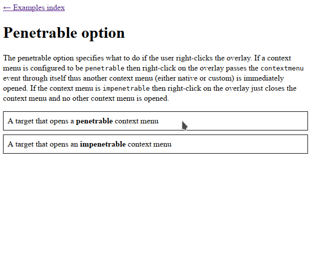
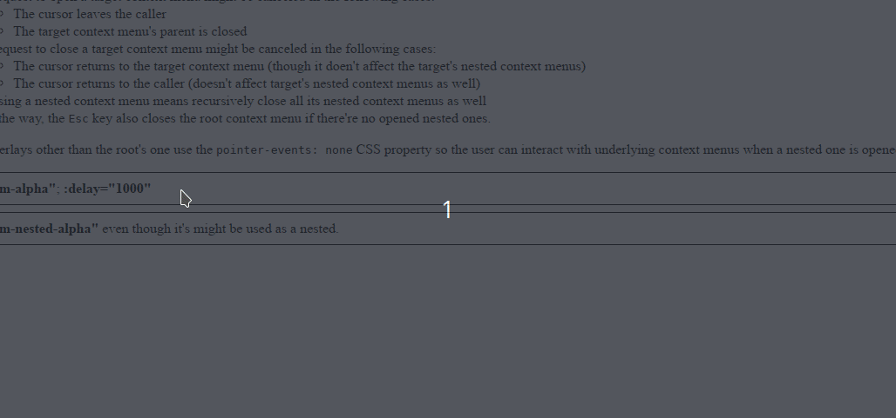

# Vue Custom Context Menu

A Vue.js plugin for building custom 🖱 Context Menus. Automatically adjusts position and supports nested context menus out of the box

## Installation

1. Install the NPM package
    ```shell
    $ npm install --save vue-custom-context-menu
    ```

1. Import it in your app's main file the preferred way

    to import as an ES6 module
    ```javascript
    import VCCM from "vue-custom-context-menu"
    ```

    to import as a CommonJS module
    ```javascript
    const VCCM = require("vue-custom-context-menu")
    ```

1. Make Vue [use the plugin](https://vuejs.org/v2/guide/plugins.html#Using-a-Plugin)
    ```javascript
    Vue.use(VCCM)
    ```

Or alternatively you can include it in the page as a separate `<script>`
```html
<script src="https://unpkg.com/vue-custom-context-menu"></script>
```

## Usage

Define Context Menus using the globally-available `<context-menu>` component. Bind the defined Context Menus to target elements/components using the `v-context-menu` directive

```html
<template>
<div class="wrapper">

    <context-menu ref="cm-for-base-header">
        <!-- we'll discuss later on what to insert here -->
    </context-menu>

    <base-header v-context-menu="'cm-for-base-header'">
        This is the BaseHeader component...
    </base-header>

    <ul>

        <!-- <context-menu> can be located anywhere in the template -->
        <context-menu ref="cm-for-list-item"></context-menu>

        <li
            v-for="item in items"
            :key="item.id"
            v-context-menu="'cm-for-list-item'"
        >
            {{ item.name }}
        </li>
    </ul>

    ...
</div>
</template>
```

> Though the `<context-menu>` component can be located anywhere in the template it's better to always define Context Menus at the top-most level (just like the "cm-for-base-header" is defined). Notice also that the `v-context-menu` is a directive, and directives accept an expression rather than a string, so the additional pair of signle quotes is necessary.

You can also wrap a Context Menu in a separate component so that you can reuse it between different targets located in separate `<template>`s

```html
<!-- Header.vue -->

<template>
<div class="wrapper">
    <cm-for-links ref="cm-for-links" />

    <header>
        <a
            href="/pricing"
            v-context-menu="'cm-for-links'"
        >
            Pricing
        </a>

        ...
    </header>
</div>
</template>

<script>
import CmForLinks from "./CmForLinks.vue";

export default {
    components: {
        CmForLinks
    }
}
</script>
```

```html
<!-- Footer.vue -->

<template>
<div class="wrapper">
    <cm-for-links ref="cm-for-links" />

    <footer>
        <router-link
            :to="{ name: 'contacts' }"
            v-context-menu="'cm-for-links'"
        >
            Contacts
        </router-link>

        ...
    </header>
</div>
</template>

<script>
import CmForLinks from "./CmForLinks.vue";

export default {
    components: {
        CmForLinks
    }
}
</script>
```

```html
<!-- CmForLinks.vue -->

<template>
    <context-menu ref="wrapped-context-menu">
        <!-- we'll discuss later on what to insert here -->
    </context-menu>
</template>
```

> Note that in such case you'd have to provide the `ref="wrapped-context-menu"` to the Context Menu that is wrapped inside a wrapper-component

You can also completely disable all the Context Menus (including the browser's native one) for a specific element by providing it with `v-context-menu="null"`

```html
<div
    class="target"
    v-context-menu="null"
>
    No Context Menus for me :(
</div>
```

> You can **always** request the native Context Menu for any element if you hold the <kbd>Alt</kbd> key during the right-click

`v-context-menu` also affects the children of the target it's bound to. Thus in the following example the Context Menu won't only be disabled for the `<p>` element, but also for all the `<div>` ones

```html
<p v-context-menu="null">
    <div>
        ...

        <div>
            ...
        </div>
    </div>
</p>
```

It's still possible however to overwrite the Context Menu for a specific child (and all of its children as well)

```html
<p v-context-menu="null">
    <div>
        Disabled for this div

        <p>and this paragraph</p>

        <div v-context-menu="'cm-alpha'">
            but both this element
            <span>and this element</span>
            open the "cm-alpha" Context Menu when right-clicked
        </div>
    </div>
</p>
```

The above pattern can become quite useful if you want to globally disable the native Context Menus for the entire app and at the same time provide custom ones for only certain elements/components.

### `<context-menu-item>`

The items for Context Menus are defined using the `<context-menu-item>` component

```html
<context-menu ref="cm-for-list-item">
    <context-menu-item :action="open">
        <strong>Open</strong>
    </context-menu-item>

    <div>You can also use any other elements/components here</div>

    <context-menu-item :action="close">
        Close
    </context-menu-item>
</context-menu>
```

The `action` prop specifies the method performed when the item is clicked. The provided function is called with 2 arguments: the target element the Context Menu is opened for and the Context Menu instance itself

```javascript
export default {
    methods: {
        open(target, cm) {
            console.log(target, cm);
            // other actions...
        },

        close(target, cm) {
            console.log(target, cm);
            // other actions...
        }
    }
}
```

You can disable an item by providing it the `disabled` prop

```html
<context-menu-item
    :action="open"
    :disabled="!cantBeOpened"
>
    Open
</context-menu-item>
```

When a disabled item is clicked, the provided action isn't fired and the Context Menu doesn't close.

### Nested Context Menus

There's no special syntax for definig nested Context Menus. Any Context Menu might be opened as a nested one. All you have to do is just to add the `v-context-menu` directive to a `<context-menu-item>`. A `<context-menu-item>` with the `v-context-menu` directive bound to it is called a *caller* (because it's used to *call* a nested Context Menu)

```html
<context-menu-item v-context-menu="'cm-with-downloading-options'">Download</context-menu-item>
```

Now when the cursor enters the item a request to open the "cm-with-downloading-options" Context Menu is registered and the Context Menu will be opened after some time (controller by the `delay` prop that we'll discuss a bit later). The nested Context Menu can also be opened immediately if the item is clicked.

Wrapped Context Menus' items can also open nested Context Menus

```html
<!-- WrappedContextMenu.vue -->

<template>
<div class="wrapper">
    <context-menu ref="wrapped-context-menu">
        <context-menu-item v-context-menu="'cm-with-downloading-options'">Download</context-menu-item>
    </context-menu>

    <context-menu ref="cm-with-downloading-options">
        <context-menu-item :action="downloadPlain">Plain</context-menu-item>
        <context-menu-item :action="downloadZip">As a Zip archive</context-menu-item>
    </context-menu>
</div>
</template>
```

> Note however that the "cm-with-downloading-options" Context Menu wouldn't normally be available anywhere outside this wrapper-component. If you need to reuse a nested Context Menu between different root Context Menus, you can always wrap the nested one itself

The `action` prop is ignored for callers

```html
<context-menu-item
    :action="neverCalled"
    v-context-menu="'cm-with-downloading-options'"
>
    Download
</context-menu-item>
```

`v-context-menu="null"` when used on the `<context-menu-item>` component acts the same as the `disabled` option

```html
<!-- all the following items are considered disabled -->

<context-menu-item disabled>Item 1</context-menu-item>
<context-menu-item v-context-menu="null">Item 2</context-menu-item>
<context-menu-item disabled v-context-menu="null">Item 3</context-menu-item>
```

Regular Context Menu items can be wrapped both with HTML elements and components

```html
<!-- both are OK -->

<context-menu>
    <div class="block">
        <context-menu-item :action="delete">Delete</context-menu-item>
    </div>

    <base-block>
        <context-menu-item :action="showInfo">Info</context-menu-item>
    </base-block>
</context-menu>
```

But bear in mind that the same **won't work** if you use **callers as slots for other components**!

```html
<context-menu>
    <!-- this one is OK (since <div> is a HTML element) -->
    <div class="block">
        <context-menu-item v-context-menu="'cm-for-other-options'">Other</context-menu-item>
    </div>

    <!-- but the following one won't work (because <base-block> is a component) -->
    <base-block>
        <context-menu-item v-context-menu="'cm-for-other-options'">Other</context-menu-item>
    </base-block>
</context-menu>
```

### Options

You can control different aspects of a Context Menu with props. There're 3 props available for a `<context-menu>` component:

1. `penetrable`  
1. `shift`
1. `delay`

#### `penetrable`

`false` by default. Accepts `Boolean` values.

Demo



The `penetrable` option, as its name suggests, allows to define Context Menus with the penetrable overlay. It means that the user will be able to focus input fields, trigger `mouseup` events, immediately open Context Menus for other targets located underneath the overlay if he clicks (or right-clicks) the overlay of an opened Context Menu.

If a Context Menu is set to be impenetrable and the user clicks/right-clicks the overlay then the Context Menu will just close.

Example of usage

```html
<context-menu
    ref="cm-for-folder-entry"
    :penetrable="true"
>
    ...
</context-menu>
```

#### `shift`

`"x"` by default. Accepts `String` values, one of: `"fit"`, `"x"`, `"y"`, `"both"`.

Demo


Unfortunately (or not) it's impossible for any HTML content to be rendered outside the browser window. It means that the custom Context Menus are restricted by the size of the viewport of the page. So when the user right-clicks somewhere near the bottom-right corner of the page it may happen so that the opened Context Menu simply won't have enough space available. The problem is solved for you out of the box and in such cases Context Menus are automatically repositioned. You can control how exactly a certain Context Menu would be transposed with this option.

`"fit"` means that the Context Menu will be rendered right at the very corner of the vireport.  
`"x"` means that it will be flipped horizontally and `fit`ted vertically  
`"y"` - flipped vertically and `fit`ted horizontally  
`"both"` - flipped both vertically and horizontally

> For *nested* Context Menus it's usually better to use `"x"` or `"both"` for a better UX  

Example of usage

```html
<context-menu
    ref="cm-for-folder-entry"
    shift="both"
>
    ...
</context-menu>
```

#### `delay`

`500` by default. Accepts `Number` values grater than 0.

Demo (1 second for the first nested Context Menu and 2 seconds for the second one)



The option controls the amount of time (in ms) before a nested Context Menu is opened after the cursor entered its caller. It also sets the amount of time to pass before the nested Context Menu is closed after a request to close it has been registered.

Note that the `delay` is set on a parent Context Menu (the one that contains callers) and affects *all* the nested Context Menus at once. It's impossible to set the `delay` for a particular Context Menu exclusively.

Example of usage

```html
<context-menu
    ref="cm-for-folder-entry"
    :delay="2000"
>
    <context-menu-item v-context-menu="'cm-alpha'">Open "cm-alpha"</context-menu-item>
    <context-menu-item v-context-menu="'cm-beta'">Open "cm-beta"</context-menu-item>
</context-menu>
```

> Note that we use `:` so that Vue can understand that we pass a `Number` rather than a `String`

### Styling

Each Context Menu internally consists of the overlay, the wrapper element, the Context Menu element itself and the Context Menu's slot-elements (`<context-menu-item>`s and other murkup)

```html
<div class="context-menu-overlay">
    <div class="context-menu-wrapper">
        <div class="context-menu">
            <div class="context-menu-item"></div>
        </div>
    </div>
</div>
```

You can style any of those elements as you prefer.

A Context Menu might be opened either as a root one or as a nested one. The `.root` or `.nested` class is added respectively both to the `.context-menu-overlay` and the `.context-menu-wrapper` so that you can style root and nested Context Menus separately

```css
.context-menu-overlay {
    /* apply these styles for each overlay */
}

.context-menu-overlay.root {
    /* these - only for overlays of the Context Menus that are opened NOT as nested ones */
}

.context-menu-overlay.root {
    /* and these - only for overlays of the nested Context Menus */
}

/* and the same for wrapper-elements */
.context-menu-wrapper {
    /* ... */
}

.context-menu-wrapper.root {
    /* ... */
}

.context-menu-wrapper.root {
    /* ... */
}
```

> Note that since nor `.context-menu-wrapper` nor `.context-menu` are explicitly exposed to your template, you might want to use the `/deep/` modifier for those

```css
/deep/ .context-menu-wrapper {}
/deep/ .context-menu {}
```

Most of the time you won't want to style overlays (these are invisible by default). However, if you want/have to, then it'd better if you only style the `.root` one since `.nested` ones are only here because of the restrictions imposed be Vue itself and don't carry almost any semantic load.

**Important! Always provide the `width` property for you custom Context Menus. They may render incorrect in some cases if you don't!**

```css
/deep/ .context-menu {
    width: 200px; /* or 10%, or 10vw, or 200ch - anything */
}

/* or */

/deep/ .context-menu-wrapper {
    width: 200px;
}

/deep/ .context-menu {
    width: 100%;
}
```

Callers have the `.caller` class added to them

```css
.context-menu-item.caller {
    background-color: red; /* make all the callers red */
}
```

Disabled items have the `.disabled` class

```css
.context-menu-item.disabled {
    background-color: gray; /* disabled items are gray */
    cursor: not-allowed; /* and the cursor looks like a stroke-through red circle */
}
```

> Callers that call `null` (i.e. `<context-menu-item v-context-menu="null" />`-elements) are also considired to be disabled, hence the `.disabled` class is added to those as well

Adding custom classes to Context Menus allows you to style different Context Menus differently. Bear in mind however that the class would only be added to the overlay, so you'd have to use nested selectors to style certain Context Menus

```html
<context-menu class="flat">
    ...
</context-menu>

<style>
/* /deep/ */ .context-menu-overlay.flat .context-menu {
    /* ... */
}
</style>
```

#### Defaults

These are the default styles that you typically don't want to overwrite with your CSS

```css
.context-menu-overlay {
    position: fixed; /* position overlays relative to the viewport */
    top: 0;
    left: 0;
    display: block;
    width: 100%; /* occupy the full width/height of the vieport */
    height: 100%;
    overflow: hidden;
    /* z-index - 100000 by default and is auto-incremented for each Context Menu opened as a nested one */
}

.context-menu-overlay.nested {
    pointer-events: none; /* overlays for nested Context Menus can be clicked-through */
}

.context-menu-wrapper {
    position: absolute; /* absolute relative to the viewport */
    pointer-events: initial; /* so that items don't ignore mouse events */
    /* height - is calculated and set automatically */
}

.context-menu {
    box-sizing: border-box;
    height: 100%;
    overflow: auto; /* so that the context can be scrolled if the Context Menu is overflowed with items */
}
```

#### Transitions

You can wrap any Context Menu inside the `<transition>` component as you do with any other components. No restrictions here. However bear in mind that you can't say the same about caller-items since those can't be wrapped inside other components (see above)

```html
<!-- OK -->
<transition name="fade">
    <context-menu>
        <!-- most probably won't work -->
        <transition name="bubble">
            <context-menu-item v-context-menu="'cm-for-user-photo'"></context-menu-item>
        </transition>
    </context-menu>
</transition>
```

## Contribution

1. Fork the repo
1. Run `npm i`
1. Make changes under `npm run watch:esm` or `npm run watch:umd`
1. Build dist-files using `npm run build`
1. Create a pull request to the "devel" branch

*Refer [here](https://github.com/smellyshovel/vue-custom-context-menu/blob/master/CONTRIBUTING.md) for more details on contribution*
